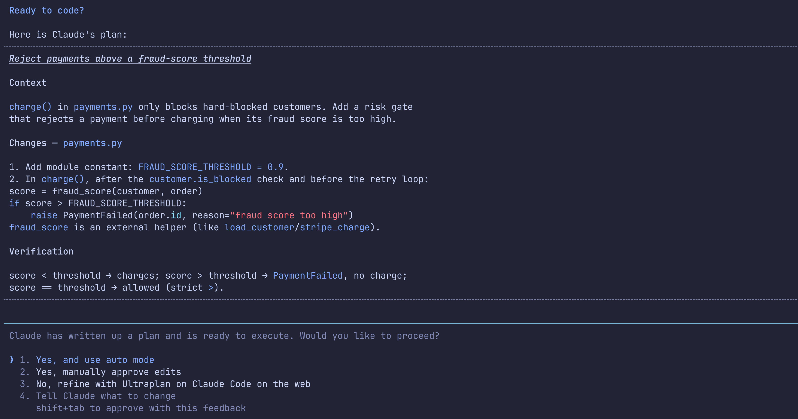
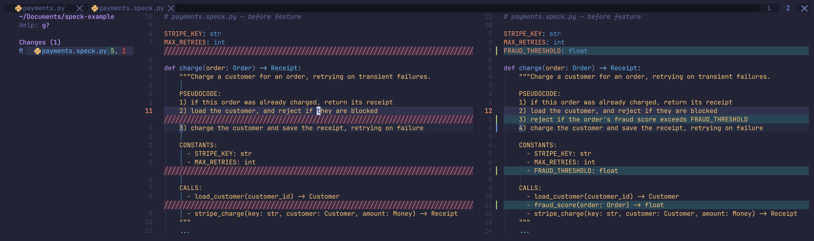
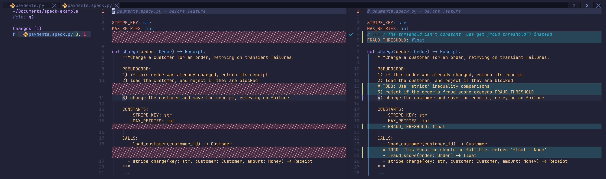

# Speck — Specification-driven Development

**Speck is a specification workflow for AI-assisted programming — inserting a new design step between 'Plan Mode' and 'Code Generation'.**

**Plan Mode** generates large blocks of text, which are hard to debug and reason about precisely.

**Code Generation** is costly, we want to _fail fast_ rather than fix design flaws at this stage.

What we need is a stage in between: a flexible specification language which improves human-AI communication while keeping you in control of code generation.

Benefits:
- Faster, more precise communication with LLMs.
- Fail fast: questions and design decisions are front-loaded.
- Hands-off implementation, with confidence that LLMs understand your design.
- Visualise and guide the final structure of the program.

Models are getting smarter, LLM-coding is getting better, but human-AI communication remains the same — speck aims to bridge this gap with a specification tool which can integrate into any existing workflow.

## Speck files

Each relevant program file gets a corresponding `.speck` file: `main.py → main.speck.py`.

Speck files strip out all implementation details, leaving only the file's structure and behaviour (e.g. types, structures, constants, and docstrings).

For example this Python file: 

```python
# payments.py — before feature

STRIPE_KEY = os.environ["STRIPE_KEY"]
MAX_RETRIES = 3

def charge(order: Order) -> Receipt:
    """Charge a customer for an order, retrying on transient failures."""
    if existing := receipts.get(order.idempotency_key):
        return existing

    customer = load_customer(order.customer_id)
    if customer.is_blocked:
        raise PaymentFailed(order.id, reason="customer blocked")

    last_error = None
    for attempt in range(MAX_RETRIES):
        try:
            receipt = stripe_charge(STRIPE_KEY, customer, order.total)
            receipts.save(order.idempotency_key, receipt)
            return receipt
        except TransientError as err:
            last_error = err
            backoff(attempt)

    raise PaymentFailed(order.id) from last_error
```

Has the corresponding speck file: 

```python
# payments.speck.py — before feature

STRIPE_KEY: str
MAX_RETRIES: int

def charge(order: Order) -> Receipt:
    """Charge a customer for an order, retrying on transient failures.

    PSEUDOCODE:
    1) if this order was already charged, return its receipt
    2) load the customer, and reject if they are blocked
    3) charge the customer and save the receipt, retrying on failure

    CONSTANTS:
      - STRIPE_KEY: str
      - MAX_RETRIES: int

    CALLS:
      - load_customer(customer_id) -> Customer
      - stripe_charge(key: str, customer: Customer, amount: Money) -> Receipt
    """
    ...
```

**Feature Changes:** the real power is in the diff, comparing speck files before and after a change shows exactly how the program's structure and behaviour will shift.

```diff
  # payments.speck.py — after feature 

  STRIPE_KEY: str
  MAX_RETRIES: int
+ FRAUD_THRESHOLD: float

  def charge(order: Order) -> Receipt:
      """Charge a customer for an order, retrying on transient failures.

      PSEUDOCODE:
      1) if this order was already charged, return its receipt
      2) load the customer, and reject if they are blocked
+     3) reject if the order's fraud score exceeds FRAUD_THRESHOLD
-     3) charge the customer and save the receipt, retrying on failure
+     4) charge the customer and save the receipt, retrying on failure

      CONSTANTS:
        - STRIPE_KEY: str
        - MAX_RETRIES: int
+       - FRAUD_THRESHOLD: float

      CALLS:
        - load_customer(customer_id) -> Customer
+       - fraud_score(order: Order) -> float
        - stripe_charge(key: str, customer: Customer, amount: Money) -> Receipt
      """
      ...
```

You agree on the design in seconds, then the LLM generates code that matches it exactly.

## The speck workflow

### 1) Plan Mode

Plan your changes as normal using 'Plan Mode'.

Don't delve too deep, just convey the general design intentions.



### 2) Speck Generation

After the plan is approved, the speck workflow initiates:

1. Generates `.speck` files for relevant files "before" the feature
2. Creates a new git commit with this change (VCS-agnostic)
3. Generates `.speck` files for relevant files "after" the feature

Now `git diff` represents the specification change: view this in your IDE using the `diff` view.



### 3) Collaborate & Review

Iterate with the LLM, either:
- Manually edit the speck files
- Add `# do this instead` directive comments (automatically picked up by the LLM)
- Or ask the LLM to reshape the specification files for you

This is your new, more precise 'Plan Mode': shape the diff into the structure you want and stay in control of the final implementation.



### 4) Code Generation

Once you are happy, sign off on the speck implementation.

The LLM can now fearlessly generate code which closely matches your intentions.

### 5) Cleanup

After you've verified the generated code, the speck files are deleted — leaving no trace in your project, config, or git history.

## Install

Installation instructions for Claude Code (but speck is compatible with any AI workflow).

### Install the skill

```sh
git clone https://github.com/DylanMoss1/speck.git
mkdir -p ~/.claude/skills/speck
cp speck/SKILL.md ~/.claude/skills/speck/SKILL.md
```

### Install the hook

Invoke the skill after every planning session (with an option to skip the workflow).

Add `speck-hook.json` into `~/.claude/settings.json`, then restart Claude Code.

## For the best experience

For the best experience:
- Turn off linting on `*.speck*` files, but keep syntax-highting and LSP configuration on.
- Use your IDE's `diff` view to compare 'before' and 'after' specks (`git diff` by default).
- Use the [grill-me](https://github.com/mattpocock/skills/blob/main/skills/productivity/grill-me/SKILL.md) skill to refine your speck files.
- Use the [superpowers](https://github.com/obra/superpowers) skill (or red-green-refactor TDD) for robust code generation.

## Philisophy

- **Any language.** The specification format is generic enough to work across any program file.
- **Unopinionated.** Speck only handles the spec-and-diff workflow. Pair it with whatever planning, questioning, or review tools you already use.
- **Leaves no trace.** Speck files are temporary. They aren't committed long-term and don't touch your project config — your teammates and CI never need to know they exists.
- **Stay in control.** Visualise and guide the end implementation, don't leave it up to chance!

## License

MIT — see [LICENSE](LICENSE).
